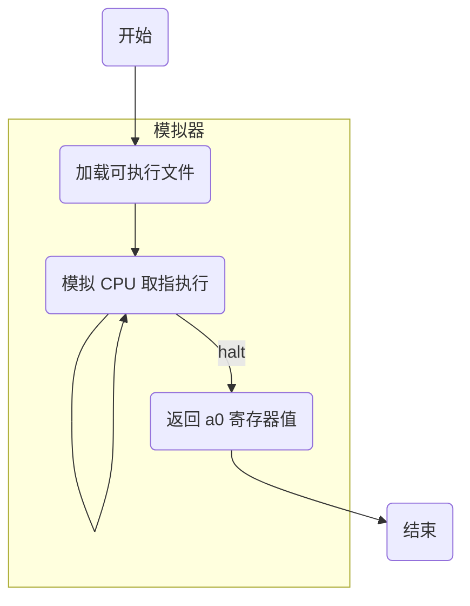

# 实现细节

## 代码结构

### 编译流程

```mermaid
graph TD

    subgraph Compiler [编译器]
        direction TD
        Lexer(词法分析)
        Parser(语法分析)
        
        subgraph SemanticAnalysis [语义分析]
            direction TD
            IdentifierResolution(标识符解析)
            TypeChecking(类型检查)
            LabelResolution(标签解析)
            LoopLabeling(循环标记)
        end
        
        TacGen(中间代码生成)

        subgraph AsmGen [汇编代码生成]
            direction TD
            TacToHighLevelAsm(中间代码至抽象汇编)
            ReplacePseudoRegister(替换伪寄存器)
            HighLevelAsmToAsm(抽象汇编至汇编)
        end
    end

    subgraph Assembler [汇编器]
        direction TD
        CollectSymbols(收集符号信息)
        ReplacePseudoAsm(替换伪指令)
        AsmToObjectFile(汇编至目标文件)
    end

    subgraph Linker [链接器]
        direction TD
        Redirect(重定位)
    end

    Start(输入源代码)
    --> |program.c| Lexer
    --> |tokens| Parser
    --> |AST| IdentifierResolution
    --> |Annotated AST| TypeChecking
    --> |Annotated AST| LabelResolution
    --> |Annotated AST| LoopLabeling
    --> |Annotated AST| TacGen
    --> |TAC| TacToHighLevelAsm
    --> |HL Asm| ReplacePseudoRegister
    --> |HL Asm| HighLevelAsmToAsm
    --> |Asm / program.s| CollectSymbols
    --> |Asm| ReplacePseudoAsm
    --> |Asm| AsmToObjectFile
    --> |Object / program.o| Redirect
    --> |Executable| Stop(输出可执行文件)
```

### 模拟LA64流程

```mermaid
graph TD
    subgraph Emulator [模拟器]
        direction TD
        Load(加载可执行文件)
        Loop(模拟 CPU 取指执行)
        Return(返回 a0 寄存器值)
    end
    Start(开始)
    --> Load
    --> Loop

    Loop --> Loop
    Loop --> |halt| Return
    --> Stop(结束)
```